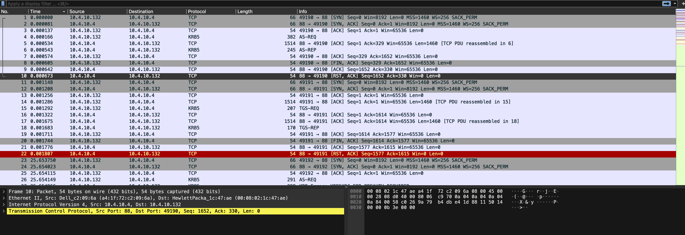
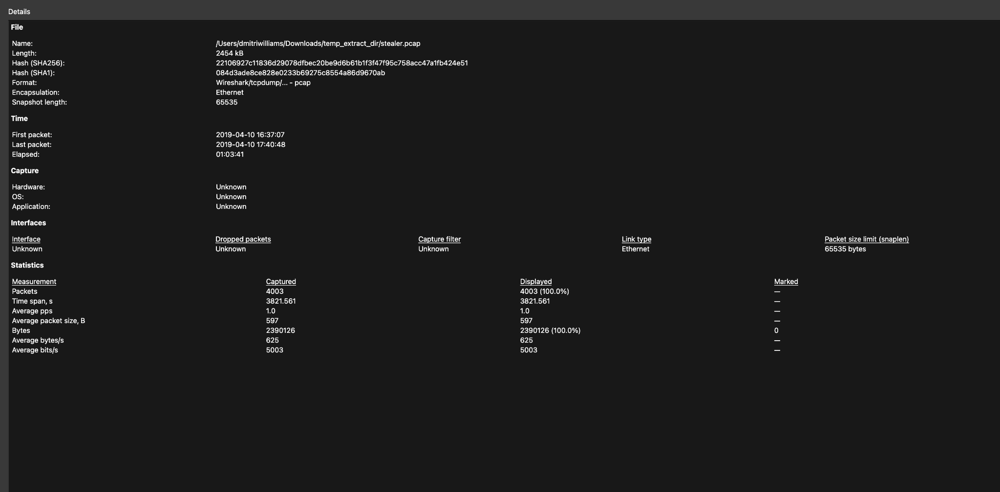
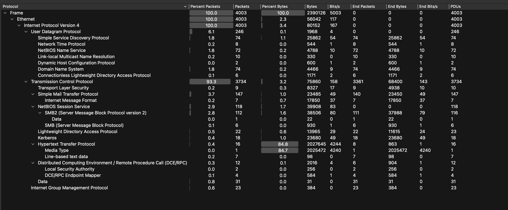
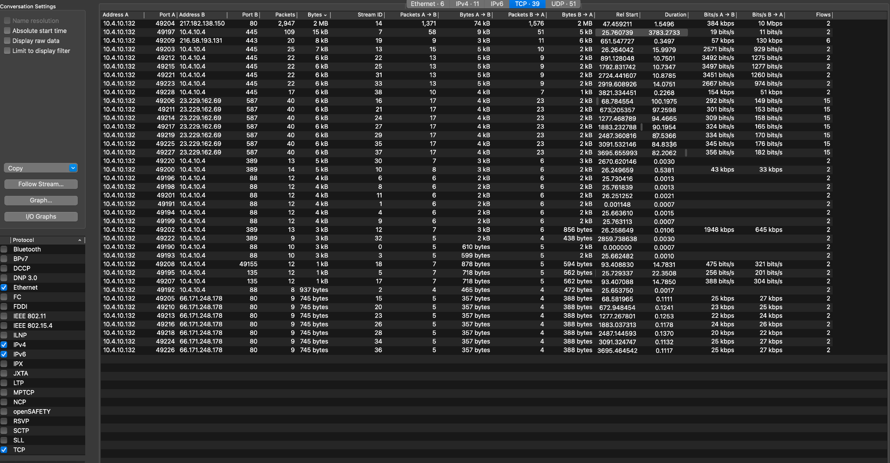
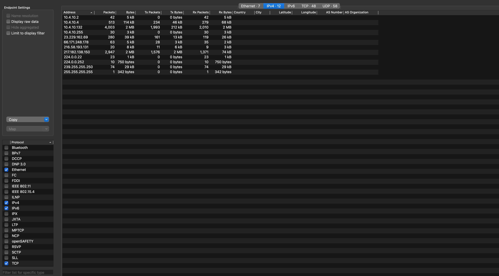
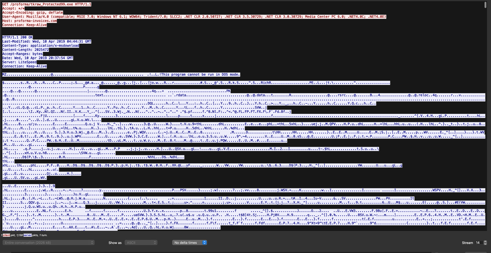
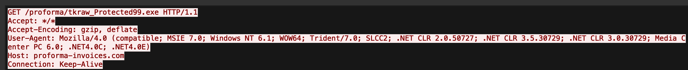
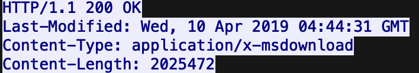

# Project 9 – Network Exfiltration Analysis (Wireshark)


---

## Overview

This project analyzes a **packet capture (PCAP) file** using Wireshark to identify suspicious network activity and determine whether malicious behavior occurred. The investigation follows a structured analysis methodology — file properties, protocol hierarchy, conversation mapping, endpoint identification, and TCP stream inspection — culminating in the identification of a confirmed malware delivery event over HTTP.

> **Key Finding:** Internal host `10.4.10.132` downloaded a malicious executable (`tkraw_Protected99.exe`) from `proforma-invoices.com` over unencrypted HTTP.

---

## Environment

| Tool | Purpose |
|------|---------|
| Wireshark | Packet capture analysis and stream inspection |
| PCAP file (`stealer.pcap`) | Evidence file — 2,454 KB, 4,003 packets |
| macOS / Terminal | Analysis environment |
| GitHub | Documentation and version control |

---

## IOC Summary

| Indicator | Value |
|-----------|-------|
| Internal Host | `10.4.10.132` |
| External IP | `217.182.138.150` |
| Malicious Domain | `proforma-invoices.com` |
| Malicious File | `tkraw_Protected99.exe` |
| Protocol | HTTP (unencrypted) |
| File Size | ~2 MB (2,025,472 bytes) |
| Content-Type | `application/x-msdownload` |
| PE Signature | `MZ` — "This program cannot be run in DOS mode." |

---

## Investigation Methodology

---

### 🟢 Step 1 — PCAP Loaded & File Properties

**Actions Taken:**
1. Loaded `stealer.pcap` into Wireshark
2. Opened **Statistics → Capture File Properties** to establish scope
3. Reviewed file metadata and packet statistics

**File Properties:**
| Property | Value |
|----------|-------|
| File Name | stealer.pcap |
| File Size | 2,454 KB |
| SHA256 | `22106927c11836d29078dfbec20be9d6b61b1f3f47f95c758acc47a1fb424e51` |
| First Packet | 2019-04-10 16:37:07 |
| Last Packet | 2019-04-10 17:40:48 |
| Elapsed Time | 01:03:41 |
| Total Packets | 4,003 |
| Total Bytes | 2,390,126 |


*PCAP loaded in Wireshark — initial packet list showing TCP/KRB5 traffic between 10.4.10.132 and internal hosts*


*Capture file properties — 4,003 packets over 63 minutes, SHA256 hash confirmed*

---

### 🔵 Step 2 — Protocol Hierarchy Analysis

**Actions Taken:**
1. Opened **Statistics → Protocol Hierarchy**
2. Identified dominant protocols by packet and byte volume
3. Flagged HTTP as a high-byte-volume outlier warranting investigation

**Key Findings:**
| Protocol | % Packets | % Bytes | Notes |
|----------|-----------|---------|-------|
| TCP | 93.3% | 3.2% | Dominant transport layer |
| HTTP | 0.4% | **84.8%** | ⚠️ Only 16 packets but 84.8% of all bytes |
| HTTP Media Type | 0.0% | **84.7%** | Large binary payload transferred |
| Kerberos | 0.4% | 1.0% | Domain authentication traffic |
| SMB2 | 2.8% | 1.6% | Internal file sharing |
| SMTP | 3.7% | 1.0% | Email traffic present |

> **Analyst Note:** HTTP accounted for 84.8% of total bytes despite only 16 packets. This extreme byte-to-packet ratio is a strong indicator of a large binary file transfer — not normal web browsing.


*Protocol hierarchy showing HTTP at 84.8% of bytes — disproportionate to packet count, indicating large file transfer*

---

### 🟡 Step 3 — Conversations & Endpoint Mapping

**Actions Taken:**
1. Opened **Statistics → Conversations → TCP tab**
2. Sorted by Bytes to identify the highest-volume connection
3. Opened **Statistics → Endpoints → IPv4 tab** to map all communicating hosts

**Top Conversation (Suspicious):**
| Field | Value |
|-------|-------|
| Internal Host | `10.4.10.132:49204` |
| External Host | `217.182.138.150:80` |
| Packets | 2,947 |
| Bytes | **2 MB** |
| Direction | 1,993 sent → 1,576 received back |

**Endpoint Summary:**
| IP Address | Packets | Bytes | Role |
|------------|---------|-------|------|
| `10.4.10.132` | 4,003 | 2 MB | Internal host — primary subject |
| `217.182.138.150` | 2,947 | 2 MB | External — malicious server |
| `23.229.162.69` | 280 | 39 kB | External — secondary contact |
| `66.171.248.178` | 63 | 5 kB | External — additional contact |


*TCP conversations sorted by bytes — 10.4.10.132 ↔ 217.182.138.150 at 2 MB is the top conversation by volume*


*IPv4 endpoints — 10.4.10.132 as primary internal host, 217.182.138.150 identified as top external communicator*

---

### 🔴 Step 4 — TCP Stream Inspection & Malware Confirmation

**Actions Taken:**
1. Right-clicked the suspicious conversation → **Follow → TCP Stream**
2. Inspected HTTP request headers — confirmed GET request for malicious executable
3. Inspected HTTP response — confirmed 200 OK, `application/x-msdownload`, 2,025,472 bytes
4. Identified `MZ` PE file signature in payload — confirming Windows executable download
5. Identified "This program cannot be run in DOS mode." string — standard PE header marker

**HTTP Request:**
```
GET /proforma/tkraw_Protected99.exe HTTP/1.1
Host: proforma-invoices.com
User-Agent: Mozilla/4.0 (compatible; MSIE 7.0; Windows NT 6.1; WOW64...)
Connection: Keep-Alive
```

**HTTP Response:**
```
HTTP/1.1 200 OK
Content-Type: application/x-msdownload
Content-Length: 2025472
Server: LiteSpeed
```

**PE Signature Confirmed:**
```
MZ....
This program cannot be run in DOS mode.
```


*Full TCP stream — HTTP GET request for tkraw_Protected99.exe and 200 OK response with PE file payload*


*HTTP GET request — GET /proforma/tkraw_Protected99.exe from host proforma-invoices.com*


*HTTP 200 OK response headers — Content-Type: application/x-msdownload, Content-Length: 2025472*


*PE file signature in payload — "This program cannot be run in DOS mode." confirming Windows executable*

---

## Conclusion

The PCAP analysis confirms a **malware delivery event** via HTTP file download:

- Internal host `10.4.10.132` initiated an HTTP GET request to `proforma-invoices.com` (resolving to `217.182.138.150`)
- The server responded with a 2 MB Windows executable: `tkraw_Protected99.exe`
- The PE file signature (`MZ` header) was confirmed in the TCP stream payload
- The file was delivered over **unencrypted HTTP on port 80** — no SSL/TLS

**Verdict: Confirmed malware delivery. Host `10.4.10.132` should be treated as compromised.**

---

## Screenshot Naming Reference

| File Name | Description |
|-----------|-------------|
| `01-pcap-loaded.png` | PCAP loaded in Wireshark — initial packet list |
| `02-capture-file-properties.png` | Capture file properties — metadata and packet statistics |
| `03-protocol-hierarchy.png` | Protocol hierarchy — HTTP at 84.8% of bytes flagged |
| `04-conversations.png` | TCP conversations sorted by bytes — top suspicious connection |
| `05-endpoints.png` | IPv4 endpoints — internal and external host mapping |
| `06-follow-stream.png` | Full TCP stream — HTTP request and PE file response |
| `07-malicious-file-download.png` | HTTP GET request for tkraw_Protected99.exe |
| `07-malicious-file-download_part_2.png` | HTTP 200 OK response headers — x-msdownload confirmed |
| `07-malicious-file-download_part_3.png` | PE signature in payload — "This program cannot be run in DOS mode." |

---

## Skills Demonstrated

| Skill | How It Was Applied |
|-------|--------------------|
| Packet Capture Analysis | Loaded and navigated a 4,003 packet PCAP in Wireshark |
| Protocol Hierarchy Analysis | Identified HTTP as anomalous by byte volume vs packet count |
| Network Conversation Mapping | Pinpointed top talker via Statistics → Conversations |
| Endpoint Identification | Mapped internal and external IPs via Statistics → Endpoints |
| TCP Stream Reconstruction | Followed TCP stream to reconstruct full HTTP exchange |
| IOC Extraction | Documented internal host, external IP, domain, filename, and file hash |
| Malware Identification | Identified PE file signature (MZ header) confirming executable delivery |
| Threat Documentation | Produced structured investigation notes and IOC summary |

---

## Lessons Learned

**Byte volume tells a different story than packet count.** HTTP made up less than 1% of packets but 84.8% of all bytes in the capture. That ratio doesn't happen with normal web browsing — it happens when a large binary is transferred. Protocol hierarchy analysis should always include a byte-volume sort, not just packet count.

**Following the stream is where the investigation becomes real.** Statistics and conversations narrow the field. The TCP stream is where you see exactly what was requested, what was returned, and what the payload contains. The HTTP GET for `tkraw_Protected99.exe` and the `MZ` PE signature in the response body are the actual evidence — not inferences.

**Unencrypted HTTP is a gift for defenders.** The entire malware delivery — request headers, response headers, and the executable payload — was visible in plaintext. In a real environment, this level of visibility would allow a SOC analyst to reconstruct the full attack chain from the PCAP alone. Encrypted C2 traffic (HTTPS) would have hidden all of it.

---

## Repository Structure

```text
Project-9-Network-Exfiltration-Analysis/
├── Project Screenshots/
│   ├── 01-pcap-loaded.png
│   ├── 02-capture-file-properties.png
│   ├── 03-protocol-hierarchy.png
│   ├── 04-conversations.png
│   ├── 05-endpoints.png
│   ├── 06-follow-stream.png
│   ├── 07-malicious-file-download.png
│   ├── 07-malicious-file-download_part_2.png
│   └── 07-malicious-file-download_part_3.png
├── notes.md
├── ioc-summary.md
└── README.md
```

---

## References

- [Wireshark User Guide](https://www.wireshark.org/docs/wsug_html_chunked/)
- [MITRE ATT&CK — Ingress Tool Transfer (T1105)](https://attack.mitre.org/techniques/T1105/)
- [PE File Format Reference](https://learn.microsoft.com/en-us/windows/win32/debug/pe-format)
- [NIST SP 800-86 — Guide to Integrating Forensic Techniques into Incident Response](https://csrc.nist.gov/publications/detail/sp/800-86/final)
